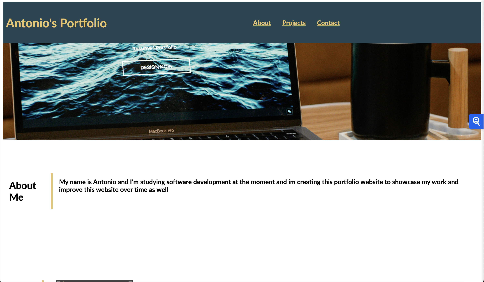

# Antonio's Portfolio

Welcome to my [website](https://antoniokod.github.io/Antonio-s-Portfolio/index.html)

## About the project

This portfolio showcases my web development skills, projects, and experiences. It serves as an online resume and a demonstration of my capabilities.

## Technologies Used
- HTML
- CSS
- Github Pages

## Features
- Responsive Design
- Project Showcase

## Structure

- Menu: Navigation links for easy access to different sections
- Title: The website's title displayed prominently
- Image: A header image to show what the website is about.

## Main Sections
1. About Me: Overview of my background and skills
2. Projects: Highlights of my projects, including an HTML project for my friend
3. Contact Information at the end of the page

